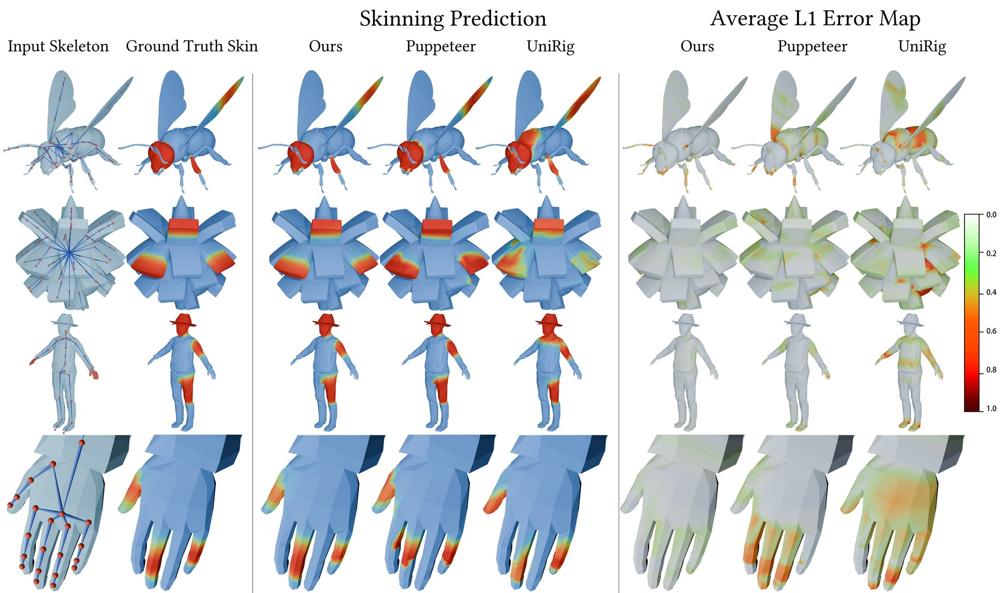

<h1 align="center">SkinTokens: A Learned Compact Representation <br/> for Unified Autoregressive Rigging</h1>

<p align="center">
<a href="https://arxiv.org/abs/2602.04805"></a>
<a href="https://zjp-shadow.github.io/works/SkinTokens/"></a>
<a href="https://huggingface.co/VAST-AI/SkinTokens"></a>
<a href="https://huggingface.co/spaces/VAST-AI/SkinTokens"></a>
<a href="https://www.tripo3d.ai"></a>
</p>

<p align="center">
  
</p>

**SkinTokens** is a learned, compact, and discrete representation for skinning weights. Built on this representation, **TokenRig** is a unified autoregressive framework that models the entire rig, i.e., skeleton and skinning weights, as a single token sequence. Given an input 3D mesh, it generates a complete skeleton hierarchy and skin weights that can be directly imported into standard 3D pipelines for character animation and simulation.

SkinTokens is the successor to [UniRig](https://github.com/VAST-AI-Research/UniRig) (SIGGRAPH '25). While UniRig uses separate stages for skeleton prediction and skinning, SkinTokens unifies both into a single autoregressive sequence via learned discrete skin tokens, yielding **98%–133%** improvement in skinning accuracy and **17%–22%** improvement in bone prediction over state-of-the-art baselines.

## 🔮 Overview

TokenRig takes a **single 3D mesh** as input and autoregressively produces a fully rigged asset — a coherent skeleton hierarchy plus dense per-vertex skinning weights — in a single unified sequence. Method in three stages:

1. **Learn SkinTokens** — An FSQ-CVAE compresses sparse skinning weights into a compact discrete vocabulary.
2. **Unified Autoregressive Modeling** — A Qwen3-0.6B-based Transformer generates the full rig (skeleton followed by SkinTokens) as one interleaved sequence.
3. **RL Refinement via GRPO** — Tailored geometric and semantic rewards (volumetric joint coverage, bone-mesh containment, skinning sparsity, deformation smoothness) refine the model for out-of-distribution assets.

<p align="center">
  
</p>

<p align="center">
  
</p>

<p align="center"><em>Qualitative comparison of skinning prediction. TokenRig produces clean, locally coherent influence maps that closely match the ground truth, while baselines suffer from "bleeding" artifacts across disconnected mesh parts.</em></p>

See the [project page](https://zjp-shadow.github.io/works/SkinTokens/) for the full teaser video and additional qualitative comparisons ([skeleton generation](https://zjp-shadow.github.io/works/SkinTokens/static/images/compare_rigging.png) and [impact of GRPO](https://zjp-shadow.github.io/works/SkinTokens/static/images/compare_grpo.png)).

## 📦 Installation

### Prerequisites
- **Hardware**: An NVIDIA GPU with at least **14 GB** of memory is required for inference.
- **Software**:
  - Python >= 3.11
  - [CUDA Toolkit](https://developer.nvidia.com/cuda-toolkit-archive) >= 12.1
  - [uv](https://docs.astral.sh/uv/) is recommended for managing dependencies.

### Installation Steps

1. Clone the repo:
    ```sh
    git clone https://github.com/VAST-AI-Research/SkinTokens.git
    cd SkinTokens
    ```

2. Create a virtual environment and install PyTorch:
    ```sh
    uv venv --python 3.11
    source .venv/bin/activate
    uv pip install torch==2.7.0 torchvision==0.22.0 torchaudio==2.7.0 --index-url https://download.pytorch.org/whl/cu128
    ```

    > [!NOTE]
    > Adjust the CUDA version in the PyTorch index URL to match your driver. See [PyTorch Get Started](https://pytorch.org/get-started/locally/) for other CUDA versions.

3. Install dependencies:
    ```sh
    uv pip install -r requirements.txt
    ```

4. Install [flash-attn](https://github.com/Dao-AILab/flash-attention):
    ```sh
    uv pip install flash-attn --no-build-isolation
    ```

5. Download pretrained models:
    ```sh
    python download.py --model
    ```

    This downloads the TokenRig and FSQ-CVAE checkpoints to `experiments/`, and the Qwen3-0.6B config to `models/`.

## 🤖 Pretrained Models

We provide the following pretrained models on [Hugging Face](https://huggingface.co/VAST-AI/SkinTokens):

| Model | Description | Download |
| --- | --- | --- |
| `articulation_xl_quantization_256_token_4` | TokenRig autoregressive rigging model, trained on ArticulationXL 2.0 + VRoid Hub + ModelsResource and refined with GRPO (**recommended**) | [Download](https://huggingface.co/VAST-AI/SkinTokens/tree/main/experiments/articulation_xl_quantization_256_token_4) |
| `skin_vae_2_10_32768` | FSQ-CVAE (SkinTokens) — skin-weight tokenizer used to encode and decode skinning weights | [Download](https://huggingface.co/VAST-AI/SkinTokens/tree/main/experiments/skin_vae_2_10_32768) |

## 💡 Usage

### Hugging Face Space Demo

The easiest way to try TokenRig without any local setup is the hosted [Hugging Face Space](https://huggingface.co/spaces/VAST-AI/SkinTokens) — upload a mesh and get a rigged result in the browser.

### Gradio Demo (local)

```sh
python demo.py
```

Then open `http://127.0.0.1:1024` in your browser.

### Command Line

```sh
# Rig a single model
python demo.py --input examples/giraffe.glb --output results/giraffe.glb

# Rig with original texture and scale preserved
python demo.py --input examples/giraffe.glb --output results/giraffe.glb --use_transfer

# Skin a model using its existing skeleton
python demo.py --input examples/giraffe_skeleton.glb --output results/giraffe.glb --use_skeleton --use_transfer

# Batch process a directory
python demo.py --input examples/ --output results/ --use_transfer
```

### Generation Parameters

| Parameter | Default | Description |
| --- | --- | --- |
| `--top_k` | 5 | Top-k sampling |
| `--top_p` | 0.95 | Top-p (nucleus) sampling |
| `--temperature` | 1.0 | Sampling temperature |
| `--repetition_penalty` | 2.0 | Repetition penalty |
| `--num_beams` | 10 | Number of beams for beam search |
| `--use_skeleton` | False | Use existing skeleton (generate skin only) |
| `--use_transfer` | False | Transfer original texture and scale |
| `--use_postprocess` | False | Apply voxel-based skin postprocessing |

### Troubleshooting

- **Server fails to start**: Make sure `http_proxy` / `https_proxy` environment variables are unset or correctly configured.
- **Blender export issues**: Remove the `glTF_not_exported` node when importing results into Blender.

## 🙏 Acknowledgements

- [UniRig](https://github.com/VAST-AI-Research/UniRig) — the predecessor to this work.
- [Qwen3](https://github.com/QwenLM/Qwen3) — the LLM architecture used by the TokenRig autoregressive backbone.
- [Michelangelo](https://github.com/NeuralCarver/Michelangelo) — 3D shape encoder.
- [3DShape2VecSet](https://github.com/1zb/3DShape2VecSet) — shape-representation backbone used by the FSQ-CVAE.
- [FSQ](https://arxiv.org/abs/2309.15505) — Finite Scalar Quantization, the discretization scheme behind SkinTokens.
- [GRPO (DeepSeekMath)](https://arxiv.org/abs/2402.03300) — the policy-optimization method used for RL refinement.
- [Tripo](https://www.tripo3d.ai) — the 3D generative studio from Tripo, a broader context for this line of work.

We sincerely appreciate the contributions of these excellent projects and their authors. We believe open source helps accelerate research, lower barriers to innovation, and make progress more accessible to the broader community.

## License

This project is licensed under the [MIT License](LICENSE).

## 📜 Citation

If you find this work helpful, please consider citing our paper:

```bibtex
@article{zhang2026skintokens,
  title   = {SkinTokens: A Learned Compact Representation for Unified Autoregressive Rigging},
  author  = {Zhang, Jia-Peng and Pu, Cheng-Feng and Guo, Meng-Hao and Cao, Yan-Pei and Hu, Shi-Min},
  journal = {arXiv preprint arXiv:2602.04805},
  year    = {2026}
}
```
